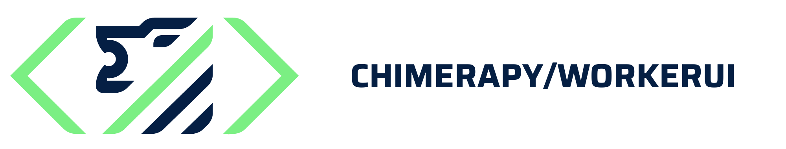

  

    <em>Worker UI and CLI Components for the ChimeraPy Framework</em>

ChimeraPy is a Scientific, Distributed Computing Framework for Real-time Multimodal Data Retrieval and Processing. This package provides Worker UI and CLI Components for the ChimeraPy Framework

## Installation
ToDo

## Contributing
Contributions are welcomed! Our [Developer Documentation](https://chimerapy.readthedocs.io/en/latest/developer/index.html) should provide more details in how ChimeraPy works and what is in current development.

## License
[ChimeraPy](https://github.com/ChimeraPy) and [ChimeraPy/WorkerUI](https://github.com/ChimeraPy/WorkerUI) uses the GNU GENERAL PUBLIC LICENSE, as found in [LICENSE](./LICENSE) file.

## Funding Info
This project is supported by the [National Science Foundation](https://www.nsf.gov/) under AI Institute  Grant No. [DRL-2112635](https://www.nsf.gov/awardsearch/showAward?AWD_ID=2112635&HistoricalAwards=false).
